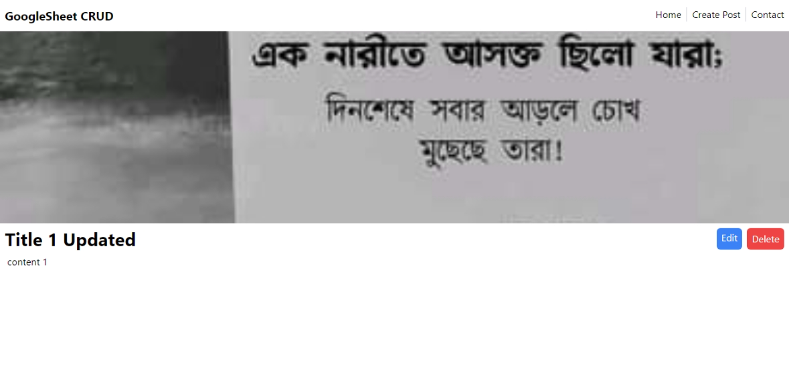

# GoogleSheet CRUD API

## Description
This is a simple API that allows you to perform CRUD operations on a Google Sheet. The API is built using App Script with Google Sheets.

## Live Demo
[Live Demo](https://google-sheet-crud.vercel.app/)


## Installation
1. Clone the repository
```bash
git clone https://github.com/AbdurRaahimm/GoogleSheet-CRUD.git
```
2. Go to project directory
```bash
cd GoogleSheet-CRUD
```
3. Install dependencies
```bash
npm install
```
4. Open the project in your favorite code editor
```bash
code .
```
5. Run the project
```bash
npm run dev
```
6. Open your browser and go to `http://localhost:5173/` to view the project

## Setup Google Sheet
1. Create a new Google Sheet
2. Go to `Extensions` -> `Apps Script`
3. Copy the bellow code and paste the code to `Code.gs` into the app script editor
```js
const sheetURL = SpreadsheetApp.openByUrl('YOUR_SHEET_URL');
const sheet = sheetURL.getSheetByName('YOUR_SHEET_NAME ');

function doGet(req){
  if(req.parameter.del){
    sheet.deleteRow(req.parameter.id)
    return ContentService.createTextOutput("Data Deleted Successfully!")
  }else if(req.parameter.update){
    try {
    
    sheet.getRange(req.parameter.id, 1).setValue('=row()');
    sheet.getRange(req.parameter.id, 2).setValue(req.parameter.title);
    sheet.getRange(req.parameter.id, 3).setValue(req.parameter.content);
    // sheet.getRange(req.parameter.id, 4).setValue(req.parameter.Photo);
    return ContentService.createTextOutput("Data Updated Successfully!");
  } catch (error) {
    // console.error("Error updating data:", error);
    return ContentService.createTextOutput("Error updating data:", error);
  }
  }
  else{
    let data = sheet.getDataRange().getValues()
    data.shift()
    return ContentService.createTextOutput(JSON.stringify(data))
  }
}

// Define a function to handle HTTP POST requests
function doPost(req){
  let data = JSON.parse(req.postData.contents);
  sheet.appendRow(['=row()',data.title, data.content, data.Photo]);
  return ContentService.createTextOutput("Data Insert Successfully!")
}

// Define a test function to log all the data in the sheet (for debugging purposes)
function text(){
  Logger.log(sheet.getDataRange().getValues())
}
```
4. Save the project
5. Go to `Deploy` button -> ` new deployment `
6. Set the `access` to `anyone` and click `Deploy` button
7. Copy the `web app URL` and use it to make requests to the API

## Screenshots
1. Home Page

2. Create Post

3. Single Post

3. Update Post


## Features
- Create a new Posts in the Google Sheet
- image upload
- Read all Posts from the Google Sheet
- Search Posts
- Update a Post 
- Delete a Post 
- Get a single Post 

## Technologies
- Google Sheets
- Google App Script
- React(vite)
- tailwindcss
- react-redux-toolkit
- react-router-dom
- react-toastify


## Author
- Abdur Raahim
